# Lab01_PART1_5479786
## Ingestão de Dados End-to-End (Local) — PNCP Contratos Públicos
## Hercules Ramos Veloso de Freitas
**Disciplina:** Fundamentos de Engenharia de Dados  
**Aluno:** Hercules — NUSP 5479786  
**Fonte de dados:** [Portal Nacional de Contratações Públicas (PNCP)](https://pncp.gov.br)  
**Período coletado:** Janeiro/2021 a Março/2026  
**Total de registros:** ~3,65 milhões de contratos públicos
 
---
Disclaimer / Aviso Legal Nota Importante: Os dados e análises apresentados neste repositório foram capturados exclusivamente para fins de estudo da API do PNCP. O pipeline de ingestão e processamento não passou por auditoria externa e as informações constantes não devem ser utilizadas como base para decisões oficiais ou denúncias, servindo apenas como demonstração técnica de Engenharia de Dados. O autor não se responsabiliza pela exatidão integral dos dados brutos provenientes da fonte original.
 
## Sumário
 
1. [Fonte de Dados](#1-fonte-de-dados)
2. [Arquitetura](#2-arquitetura)
3. [Estrutura de Diretórios](#3-estrutura-de-diretórios)
4. [Scripts](#4-scripts)
5. [Camada Bronze](#5-camada-bronze-raw)
6. [Camada Silver](#6-camada-silver-tratamento)
7. [Camada Gold](#7-camada-gold-businesswarehouse)
8. [Dicionário de Dados](#8-dicionário-de-dados)
9. [Qualidade dos Dados](#9-qualidade-dos-dados)
10. [Gráficos da Camada Silver](#10-gráficos-da-camada-silver)
11. [Gráficos da Camada Gold](#11-gráficos-da-camada-gold)
12. [Métricas de Negócio](#12-métricas-de-negócio-13-queries)
13. [Instruções de Execução](#13-instruções-de-execução)
 
---
 
## 1. Fonte de Dados
 
O **PNCP** (Portal Nacional de Contratações Públicas) é o repositório oficial do governo federal brasileiro para publicação de contratos, editais e atas de órgãos públicos, conforme exigido pela **Lei 14.133/2021**.
 
| Atributo | Valor |
|---|---|
| **API** | `https://pncp.gov.br/api/consulta/v1/contratos` |
| **Formato** | JSON paginado (até 500 registros/página) |
| **Acesso** | Público, sem autenticação |
| **Cobertura** | Todos os entes federativos (federal, estadual, municipal) |
| **Tipagem** | strings, datas, floats, inteiros, objetos aninhados |
| **Volume** | ~3,65M registros (Jan/2021–Mar/2026) |
 
A base atende a todos os requisitos do laboratório: mais de 1 milhão de linhas, tipagem rica, dados reais e atuais, API pública documentada.
 
---
 
## 2. Arquitetura
 
### Fluxo geral
 
```
API PNCP (JSON)
      │
      ▼
 bronze.py ──────────────► data/raw/AAAA_MM/pagina_NNNN.json
      │                     (JSON bruto, sem alterações)
      ▼
 silver.py ──────────────► data/silver/contratos_AAAA_MM.parquet
      │                     (dados limpos, tipados, snake_case)
      ▼
 gold_setup.py ──────────► PostgreSQL: Star Schema (tabelas + índices)
      │
 gold_load.py ───────────► PostgreSQL: Parquets → fato + dimensões
      │
 gold_graficos.py ───────► data/graficos/g*.png (gráficos analíticos)
```
 
### Diagrama da Medallion Architecture
 
```
┌─────────────────────────────────────────────────────────────────┐
│  BRONZE (Raw)          SILVER (Tratado)      GOLD (Warehouse)   │
│                                                                  │
│  data/raw/             data/silver/          PostgreSQL          │
│  ├─ 2021_01/           ├─ contratos_         ├─ dim_tempo        │
│  │  ├─ pagina_0001     │  2021_01.parquet    ├─ dim_modalidades  │
│  │  └─ _manifesto      ├─ contratos_         ├─ dim_orgaos       │
│  ├─ 2021_02/           │  2021_02.parquet    ├─ dim_fornecedores │
│  └─ ...                └─ ...               ├─ dim_situacoes    │
│                                              └─ fato_contratos   │
└─────────────────────────────────────────────────────────────────┘
```
 
### Star Schema (Gold)
 
```
                    dim_tempo
                   (id_data PK)
                        │
   dim_fornecedores      │        dim_orgaos
  (cnpj_contratada PK)  │       (orgao_entidade_id PK)
          │              │              │
          └──────── fato_contratos ─────┘
                         │
              ┌──────────┴──────────┐
         dim_modalidades      dim_situacoes
        (id_modalidade PK)   (id_situacao PK)
```
 
**Diagrama ERD — Star Schema gerado no pgAdmin**
 
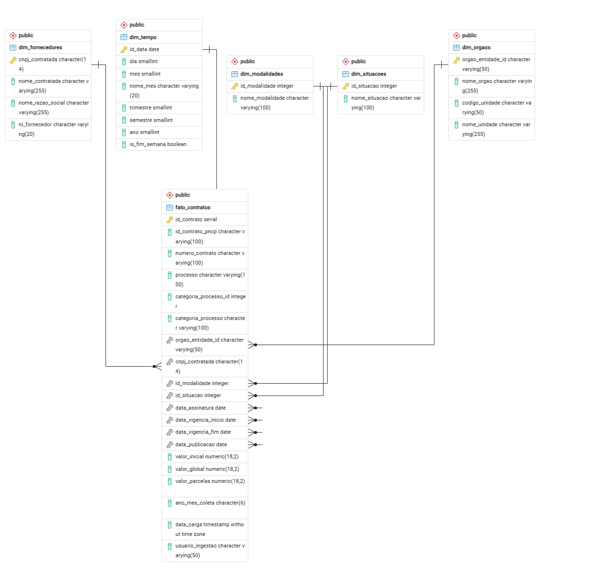
 
---
 
## 3. Estrutura de Diretórios
 
```
fundamentos/
├── bronze.py               # Coleta raw da API PNCP
├── silver.py               # Tratamento + relatório + gráficos Silver
├── gold_setup.py           # Cria schema no PostgreSQL
├── gold_load.py            # Carrega Silver → PostgreSQL
├── gold_graficos.py        # Gráficos analíticos da camada Gold
├── gold_queries.sql        # 13 queries de negócio
├── docker-compose.yml      # PostgreSQL 16 em container
├── requirements.txt        # Dependências Python
│
├── data/
│   ├── raw/                # Bronze: JSONs brutos por mês
│   │   ├── 2021_01/
│   │   │   ├── pagina_0001.json
│   │   │   └── _manifesto.json
│   │   └── ...
│   ├── silver/             # Silver: Parquets tratados
│   │   ├── contratos_2021_01.parquet
│   │   └── ...
│   └── graficos/           # Relatório + gráficos Silver e Gold
│       ├── relatorio_qualidade.txt
│       ├── graficos_silver.md
│       ├── 01_boxplot_anos.png         ← Silver
│       ├── 02_histograma.png           ← Silver
│       ├── 03_top_fornecedores.png     ← Silver
│       ├── 04_serie_temporal.png       ← Silver
│       ├── 05_correlacoes.png          ← Silver
│       ├── g1_evolucao_modalidade.png  ← Gold
│       ├── g2_top_orgaos.png           ← Gold
│       ├── g3_pareto_fornecedores.png  ← Gold
│       ├── g4_sazonalidade.png         ← Gold
│       ├── g5_boxplot_modalidade.png   ← Gold
│       ├── g6_delay_publicacao.png     ← Gold
│       ├── g7_usp_fornecedores.png     ← Gold
│       └── g8_ticket_medio_categoria.png ← Gold
│
└── logs/
    ├── bronze.log
    ├── silver.log
    └── gold_load.log
```
 
---
 
## 4. Scripts
 
| Script | Camada | Descrição |
|--------|--------|-----------|
| `bronze.py` | Bronze | Coleta paginada da API com paralelismo e checkpoint |
| `silver.py` | Silver | Tratamento, limpeza, relatório de qualidade e gráficos |
| `gold_setup.py` | Gold | Cria tabelas, índices e popula `dim_tempo` |
| `gold_load.py` | Gold | Carrega Parquets Silver → dimensões + fato |
| `gold_graficos.py` | Gold | 8 gráficos analíticos conectando ao PostgreSQL |
| `gold_queries.sql` | Gold | 13 queries SQL de métricas de negócio |
| `docker-compose.yml` | Infra | PostgreSQL 16 com tuning para 16 GB RAM |
 
---
 
## 5. Camada Bronze (Raw)
 
### Objetivo
Ingestão **as-is** da API PNCP — cada página salva como JSON sem nenhuma alteração.
 
### Como funciona
 
- Cada mês gera `data/raw/AAAA_MM/` com um arquivo por página da API
- `_manifesto.json` gravado **somente após** todas as páginas serem salvas com sucesso — garante retomada segura
- **Janela deslizante:** os últimos 6 meses são re-verificados para capturar publicações retroativas com custo de apenas 1 request extra por mês
 
### Configuração da API
 
```python
API_CONFIG = {
    'page_size':           500,   # máximo aceito pela API
    'max_workers':         3,     # workers paralelos
    'delay_between_pages': 0.5,   # intervalo entre requests (s)
    'backoff_factor':      3,     # espera exponencial em erros 429
    'max_retries':         7,
}
```
 
**Log de execução da Camada Bronze — coleta paginada da API PNCP**
 
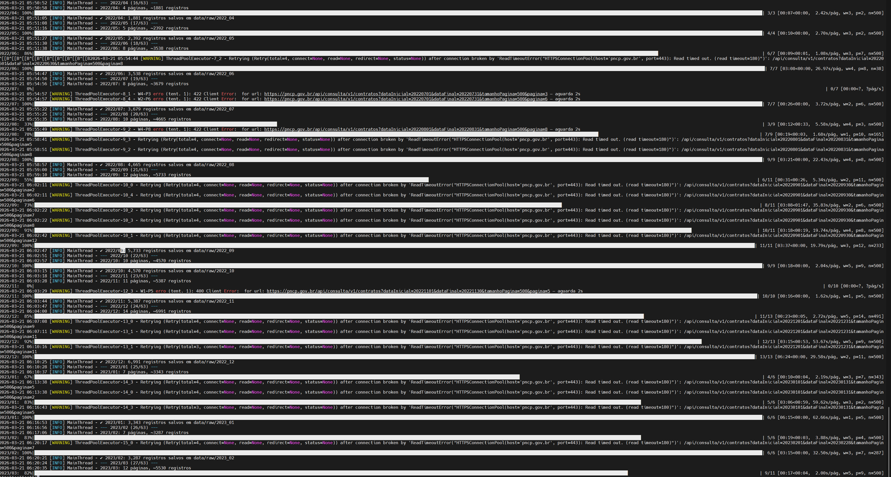
 
---
 
## 6. Camada Silver (Tratamento)
 
### Etapas aplicadas
 
1. **Desaninhamento** — `orgaoEntidade`, `unidadeOrgao`, `tipoContrato` e `categoriaProcesso` chegam como objetos JSON aninhados; `_flatten_registro()` os expande
2. **Renomeação** — camelCase → snake_case via `COL_MAP`
3. **Log de nulos** — registrado por mês antes de qualquer limpeza
4. **Deduplicação** — por `id` (número de controle PNCP)
5. **Limpeza de strings** — strip + remoção de artefatos (`None`, `nan`)
6. **Conversão de tipos** — float64 para valores, int64 para IDs, datetime64[ms] para datas
7. **Filtro de sanidade** — remove `valor_global > R$ 10 bilhões` (~74k registros, 1,92%)
8. **Persistência** — Parquet comprimido com Snappy
 
### Uso
 
```bash
python silver.py                # só tratamento
python silver.py --relatorio    # + relatório de qualidade
python silver.py --graficos     # + 5 gráficos + Markdown
python silver.py --tudo         # tudo
```
 
**Log de execução da Camada Silver — tratamento e sanidade dos dados**
 
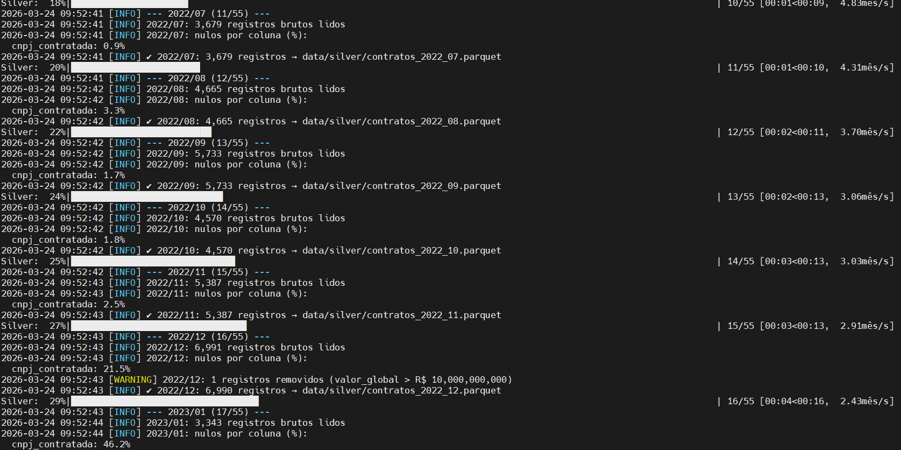
 
---
 
## 7. Camada Gold (Business/Warehouse)
 
### Tabela Fato: `fato_contratos`
 
| Coluna | Tipo | Descrição |
|---|---|---|
| `id_contrato` | SERIAL PK | Chave surrogate |
| `id_contrato_pncp` | VARCHAR | Número de controle PNCP |
| `numero_contrato` | VARCHAR | Número do contrato/empenho |
| `processo` | VARCHAR | Número do processo licitatório |
| `categoria_processo_id` | INTEGER | ID da categoria (1=Obras, 2=Compras...) |
| `categoria_processo` | VARCHAR | Nome da categoria |
| `orgao_entidade_id` | VARCHAR → FK | CNPJ do órgão contratante |
| `cnpj_contratada` | CHAR(14) → FK | CNPJ do fornecedor |
| `id_modalidade` | INTEGER → FK | Tipo de contrato |
| `id_situacao` | INTEGER → FK | Situação (NULL — ver Qualidade) |
| `data_assinatura` | DATE → FK | Data de assinatura |
| `data_vigencia_inicio` | DATE → FK | Início da vigência |
| `data_vigencia_fim` | DATE → FK | Fim da vigência |
| `data_publicacao` | DATE → FK | Data de publicação no PNCP |
| `valor_inicial` | NUMERIC(18,2) | Valor original do contrato (R$) |
| `valor_global` | NUMERIC(18,2) | Valor total consolidado (R$) |
| `valor_parcelas` | NUMERIC(18,2) | Valor por parcela (R$) |
| `ano_mes_coleta` | CHAR(6) | Mês de coleta (ex: `202503`) |
| `data_carga` | TIMESTAMP | Data/hora da carga no DW |
| `usuario_ingestao` | VARCHAR | Identificador do processo de carga |

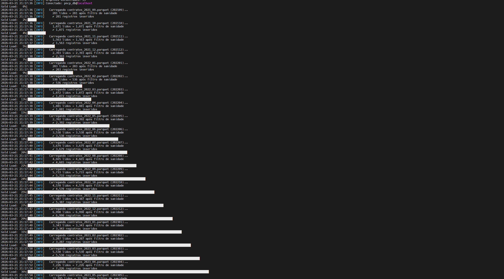
---
 
## 8. Dicionário de Dados
 
### Camada Silver — campos da API PNCP
 
| Campo | Origem API | Tipo | Descrição |
|---|---|---|---|
| `id` | `numeroControlePNCP` | string | Identificador único no PNCP |
| `orgao_entidade_id` | `orgaoEntidade.cnpj` | string | CNPJ do órgão contratante |
| `orgao_entidade_nome` | `orgaoEntidade.razaoSocial` | string | Razão social do órgão |
| `objeto_contrato` | `objetoContrato` | string | Descrição do objeto contratado |
| `numero_contrato` | `numeroContratoEmpenho` | string | Número do contrato ou empenho |
| `processo` | `processo` | string | Número do processo administrativo |
| `categoria_processo_id` | `categoriaProcesso.id` | int64 | ID da categoria |
| `categoria_processo_nome` | `categoriaProcesso.nome` | string | Nome da categoria |
| `cnpj_contratada` | `niFornecedor` (PJ) | string | CNPJ do fornecedor |
| `nome_contratada` | `nomeRazaoSocialFornecedor` | string | Nome do contratado |
| `valor_inicial` | `valorInicial` | float64 | Valor inicial (R$) |
| `valor_global` | `valorGlobal` | float64 | Valor total (R$) |
| `valor_parcelas` | `valorParcela` | float64 | Valor por parcela (R$) |
| `data_assinatura` | `dataAssinatura` | timestamp | Data de assinatura |
| `data_vigencia_inicio` | `dataVigenciaInicio` | timestamp | Início da vigência |
| `data_vigencia_fim` | `dataVigenciaFim` | timestamp | Fim da vigência |
| `situacao_contrato_id` | `situacaoContratoId` | int64 | **Ausente na API** — sempre 0 |
| `situacao_contrato_nome` | `situacaoContratoNome` | string | **Ausente na API** — sempre vazio |
| `data_publicacao` | `dataPublicacaoPncp` | timestamp | Data de publicação no PNCP |
| `ni_fornecedor` | `niFornecedor` | string | CPF ou CNPJ do fornecedor |
| `nome_razao_social_fornecedor` | `nomeRazaoSocialFornecedor` | string | Nome completo do fornecedor |
| `codigo_unidade` | `unidadeOrgao.codigoUnidade` | string | Código da unidade gestora |
| `nome_unidade` | `unidadeOrgao.nomeUnidade` | string | Nome da unidade gestora |
| `modalidade_id` | `tipoContrato.id` | int64 | ID do tipo de contrato |
| `modalidade_nome` | `tipoContrato.nome` | string | Nome do tipo de contrato |
| `ano_mes_coleta` | *(gerado)* | string | Mês de referência (AAAAMM) |
| `data_coleta` | *(gerado)* | timestamp | Momento da execução do silver.py |
 
---
 
## 9. Qualidade dos Dados
 
### Visão geral
 
| Métrica | Valor |
|---|---|
| Total bruto coletado | 3.865.548 registros |
| Após filtro de sanidade | 3.791.390 registros |
| Descartados (valor > R$10bi) | 74.158 (1,92%) |
| Período | 2021-04 a 2026-03 |
| Arquivos Parquet | 55 |
 
### Problemas encontrados
 
| Coluna | % Ausente | Nível | Causa |
|---|---|---|---|
| `situacao_contrato_nome` | **100%** | 🔴 CRÍTICO | Campo inexistente no endpoint `/contratos` da API PNCP v1 |
| `cnpj_contratada` | 4,04% | 🟡 BAIXO | Fornecedores PF têm CPF, não CNPJ |
| `processo` | 0,46% | 🟢 BAIXO | Empenhos diretos sem processo licitatório |
| `nome_contratada` | 0,02% | 🟢 BAIXO | Registros sem identificação do contratado |
| `data_vigencia_fim` | 0,006% | 🟢 BAIXO | Contratos sem prazo definido |
| `data_assinatura` fora 2021-2026 | 0,0003% | 🟢 BAIXO | Erros de digitação na fonte (ex: ano 2102) |
 
### Zeros sentinela
 
| Coluna | % Zeros | Observação |
|---|---|---|
| `situacao_contrato_id` | ~100% | Ausente na API — 0 é sentinela |
| `valor_inicial` | ~26% | Contratos sem valor inicial informado |
| `valor_parcelas` | ~23% | Contratos sem parcelamento |
 
### Estatísticas descritivas — `valor_global`
 
| Estatística | Valor |
|---|---|
| Total | R$ 2.021,95 bilhões |
| Média | R$ 533.300,37 |
| Mediana | R$ 3.276,91 |
| Desvio Padrão | R$ 27.763.603,68 |
| P25 | R$ 600,00 |
| P75 | R$ 23.000,00 |
| P95 | R$ 414.800,00 |
| P99 | R$ 3.794.599,65 |
 
> Mediana muito abaixo da média confirma forte assimetria à direita — maioria são empenhos de pequeno valor, com poucos contratos de grande porte (obras, concessões) puxando a média.
 
---
 
## 10. Gráficos da Camada Silver
 
Gerados por `python silver.py --graficos` em `data/graficos/`.
 
### Gráfico 1 — Distribuição de Valores por Ano (Boxplot)
 

 
Boxplot em escala log₁₀ mostrando a distribuição do `valor_global` por ano. Cada caixa representa o IQR (P25–P75). Crescimento consistente no volume de contratos a partir de 2023, reflexo da adesão crescente ao PNCP após a Lei 14.133/2021.
 
---
 
### Gráfico 2 — Histograma de Distribuição de Valores
 

 
Distribuição do `valor_global` em escala log₁₀ com frequência linear (esquerda) e logarítmica (direita). Concentração entre R$100 e R$1 milhão reflete empenhos e contratos de serviços. Cauda direita indica contratos de grande porte.
 
---
 
### Gráfico 3 — Top 20 Fornecedores
 

 
Painel esquerdo: maior volume financeiro. Painel direito: maior frequência de contratos. Os maiores em valor não são os mais frequentes — contratos de grande porte tendem a ser únicos (obras, concessões).
 
---
 
### Gráfico 4 — Série Temporal Mensal
 

 
Evolução mês a mês do valor total e da quantidade de contratos. Picos em dezembro refletem pressão de encerramento do exercício orçamentário. Crescimento acentuado a partir de 2024 com a expansão do uso obrigatório do PNCP.
 
---
 
### Gráfico 5 — Heatmap de Correlações
 

 
Correlação de Pearson entre variáveis numéricas. Correlação positiva entre Ano e Valor confirma crescimento temporal. Baixa correlação entre Mês e Valor indica que a sazonalidade afeta mais a quantidade do que o valor médio.
 
---
 
## 11. Gráficos da Camada Gold
 
Gerados por `python gold_graficos.py` — conecta ao PostgreSQL em tempo real.
 
### G1 — Evolução Anual por Modalidade
 
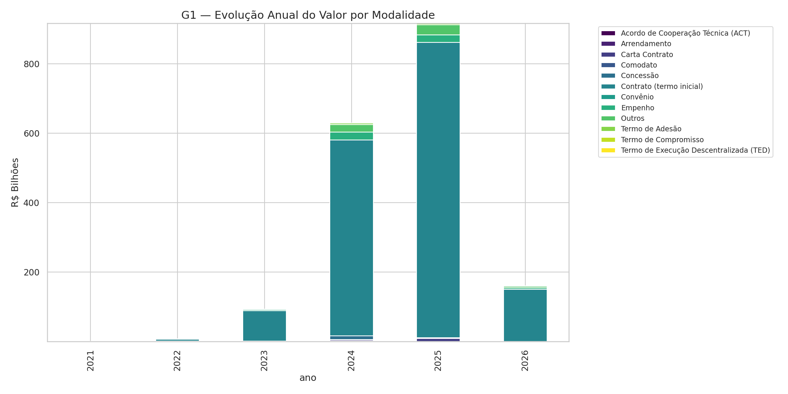
 
Barras empilhadas mostrando a composição do valor total anual por tipo de contrato. Permite identificar quais modalidades cresceram mais e como mudou o perfil de contratação ao longo dos anos.
 
---
 
### G2 — Top 10 Órgãos Gastadores
 
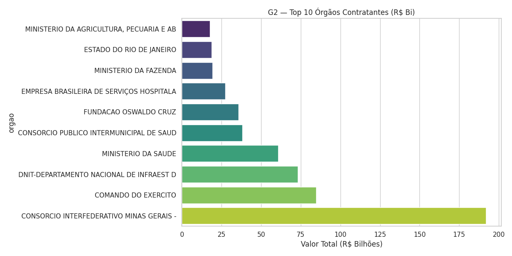
 
Ranking dos maiores centros de custo do setor público. Identifica concentração de gastos e quais entidades respondem pela maior parte do valor contratado no período.
 
---
 
### G3 — Curva de Pareto dos Fornecedores
 
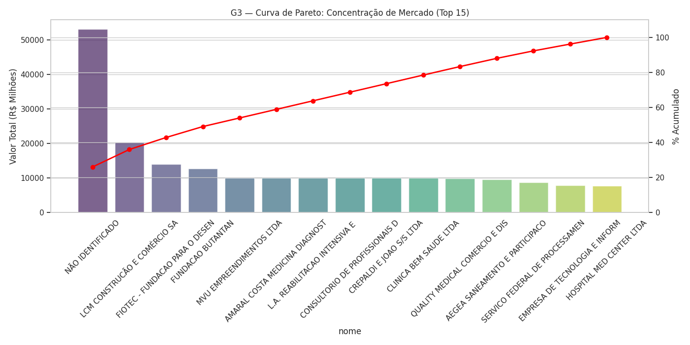
 
Barras com valor total + linha de percentual acumulado. A linha vermelha horizontal em 80% permite verificar quantos fornecedores concentram 80% do valor total — análise clássica de dependência de mercado.
 
---
 
### G4 — Sazonalidade Mensal (2021–2025)
 
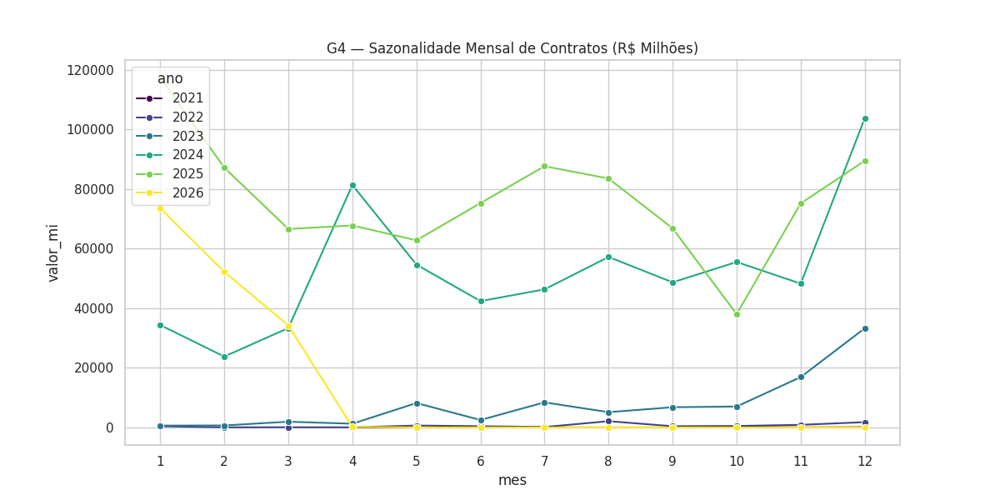
 
Linhas por ano mostrando o padrão de contratação ao longo dos meses. Picos recorrentes em dezembro confirmam a pressão do encerramento do exercício orçamentário brasileiro.
 
---
 
### G5 — Boxplot por Modalidade (Escala Log)
 
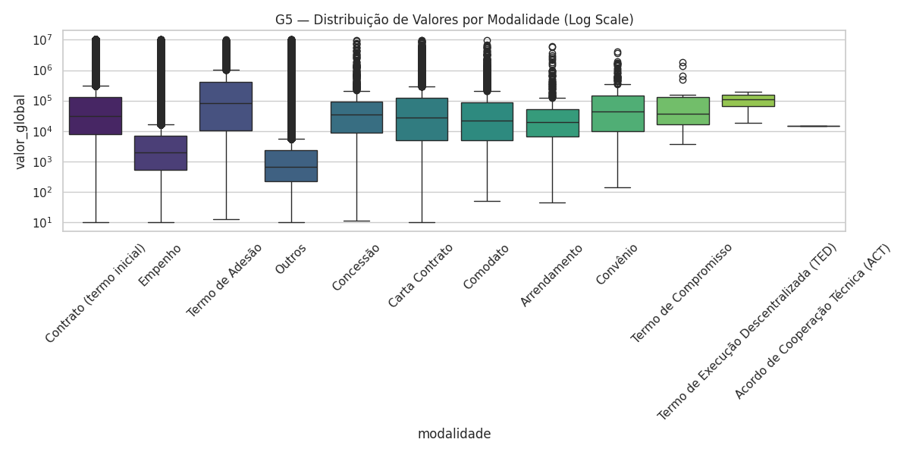
 
Distribuição de `valor_global` por tipo de contrato em escala logarítmica. Permite comparar o perfil financeiro real de cada modalidade — empenhos têm distribuição muito diferente de contratos de obras.
 
---
 
### G6 — Delay de Publicação (Transparência)
 
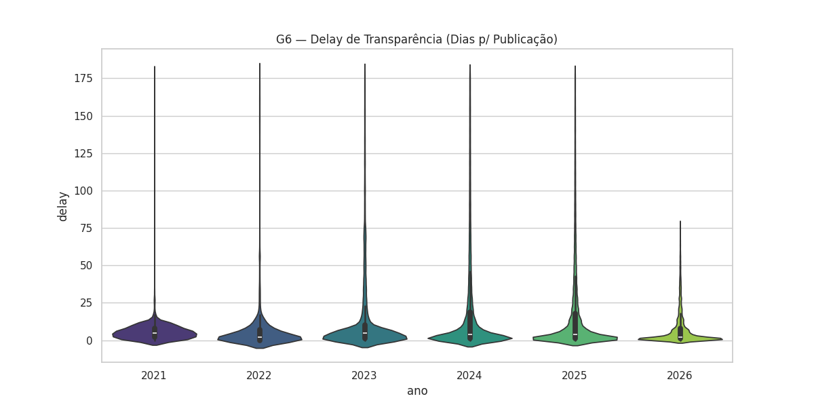
 
Violino mostrando a distribuição de dias entre assinatura e publicação no PNCP. A linha em 20 dias serve como referência de boas práticas de transparência. Concentração acima dessa linha indica baixa agilidade na publicação.
 
---
 
### G7 — Top 10 Fornecedores da USP
 
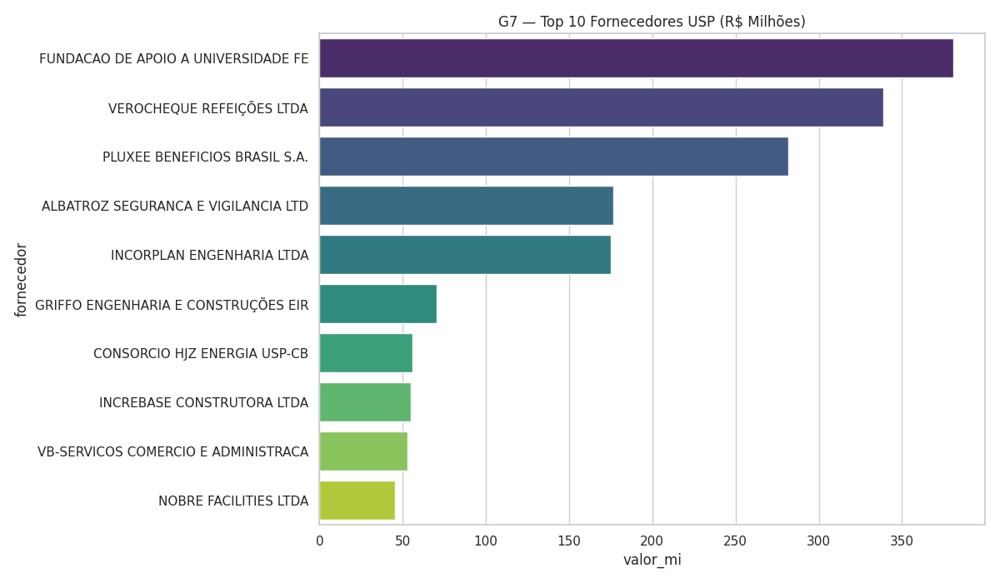
 
Ranking dos maiores fornecedores da Universidade de São Paulo, com volume financeiro total e frequência de contratos indicada pela escala de cor. Permite identificar dependência da USP em relação a fornecedores específicos.
 
---
 
### G8 — Ticket Médio por Categoria (Heatmap)
 
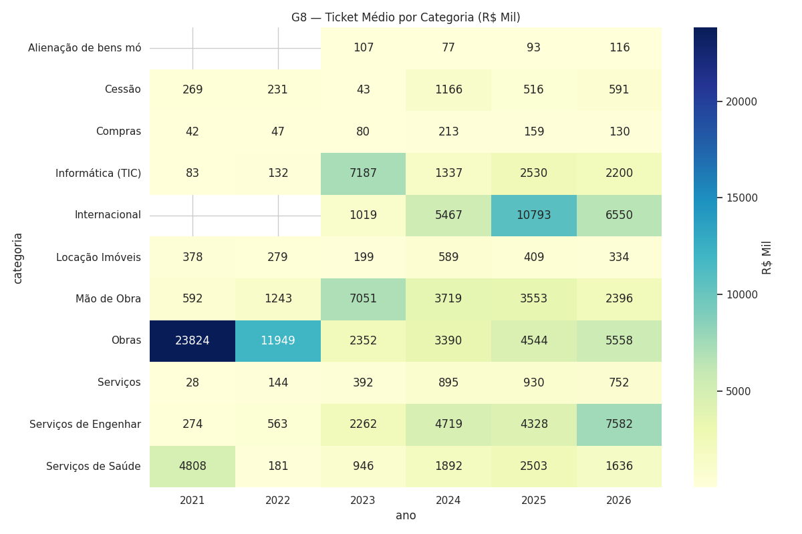
 
Heatmap mostrando a evolução do valor médio por categoria de contrato ao longo dos anos. Células mais escuras indicam contratos de maior valor médio — útil para identificar categorias com crescimento de custo acima da média.
 
---
 
## 12. Métricas de Negócio (13 Queries)
 
Todas as queries estão em `gold_queries.sql`.
 
| ID | Query | Objetivo |
|---|---|---|
| Q1 | Evolução por Modalidade | Tendência histórica de tipos de contratação |
| Q2 | Top 10 Órgãos Gastadores | Maiores centros de custo do país |
| Q3 | Pareto de Fornecedores | Análise de dependência e concentração de mercado |
| Q4 | Sazonalidade Trimestral | Pressão orçamentária por período do ano |
| Q5 | Compromisso Ativo | Estoque de contratos vigentes (fluxo de caixa futuro) |
| Q6 | IFs e Universidades | Recorte setorial de Educação Superior e Técnica |
| Q7 | Top 100 USP | Análise detalhada dos contratos da Universidade de São Paulo |
| Q8 | Variação de Valor | Comparação Valor Inicial × Global (detecção de aditivos) |
| Q9 | Delay de Publicação | Eficiência e transparência (assinatura vs. publicação) |
| Q10 | Mediana por Modalidade | Perfil financeiro real de cada tipo de licitação |
| Q11 | Fracionamento | Múltiplos contratos com mesmo fornecedor/mês (possível fracionamento) |
| Q12 | Ticket Médio Anual | Evolução do custo médio por categoria |
| Q13 | Geografia por CNPJ | Concentração de gastos por esfera administrativa |
 
---
 
## 13. Instruções de Execução

 ### Aviso — Dados Originais (Bronze → Silver → Gold)
Os arquivos completos das camadas Bronze, Silver e Gold não estão incluídos neste repositório devido ao tamanho elevado e ao tempo de processamento da etapa Bronze (coleta integral do PNCP).

Para garantir reprodutibilidade total, todos os dados gerados pelo pipeline estão disponíveis no seguinte link:

## Google Drive — Dados do Projeto  
https://drive.google.com/drive/folders/1GwuG8CvDkoFgTeHnfzhDZ6MAUNOPdEAl?usp=drive_link

Conteúdo disponível no Drive:

data/raw/ — JSONs brutos da API PNCP (Bronze)

data/silver/ — Parquets tratados e tipados (Silver)

data/gold/ — Exportações do DW (opcional)

logs/ — Logs completos de execução

graficos/ — Gráficos gerados automaticamente
 
### Pré-requisitos
 
- Python 3.10+
- Docker + Docker Compose
- PostgreSQL 16 (via Docker)
 
### Instalação
 
```bash
git clone https://github.com/hrvfreitas/Lab01_PART1_5479786
cd Lab01_PART1_5479786
 
python3 -m venv .venv
source .venv/bin/activate       # Linux/macOS
# .venv\Scripts\activate        # Windows
 
pip install -r requirements.txt
```
 
**Instalação das dependências via pip**
 
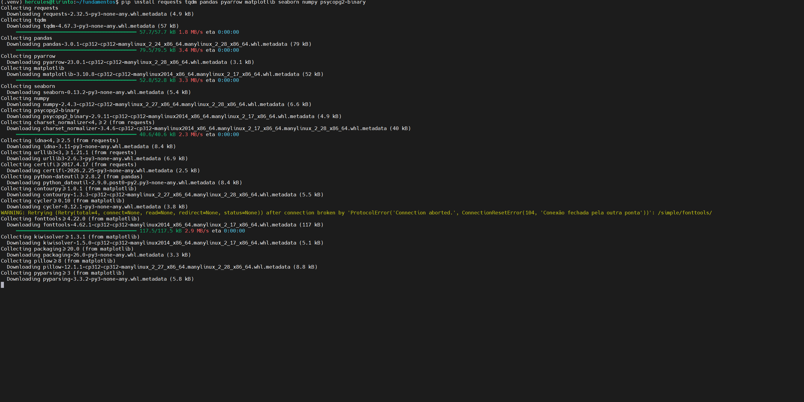
 
### `requirements.txt`
 
```
requests>=2.31.0
tqdm>=4.66.0
pandas>=2.0.0
pyarrow>=14.0.0
matplotlib>=3.7.0
seaborn>=0.13.0
numpy>=1.26.0
psycopg2-binary>=2.9.0
sqlalchemy>=2.0.0
```
 
### Ordem de execução
 
```bash
# 1. Coleta Bronze (~15h — use tmux para deixar rodando)
tmux new -s pncp
python bronze.py
# Ctrl+B D para desconectar | tmux attach -t pncp para reconectar
 
# 2. Tratamento Silver + relatório + gráficos (~30 min)
python silver.py --tudo
 
# 3. Sobe o PostgreSQL via Docker
docker compose up -d
docker compose ps    # aguarda status: healthy
 
# 4. Cria o schema Gold e carrega os dados (~10 min)
python gold_setup.py
python gold_load.py
 
# 5. Gera os gráficos analíticos da camada Gold
python gold_graficos.py
 
# 6. Executa as queries no pgAdmin ou psql
psql -h localhost -U postgres -d pncp_db -f gold_queries.sql
```
 
### Conexão ao banco
 
```
Host:     localhost (ou IP do servidor na rede local)
Port:     5432
Database: pncp_db
Username: postgres
Password: postgres
```
 
**pgAdmin — Schema público com as 6 tabelas criadas**
 
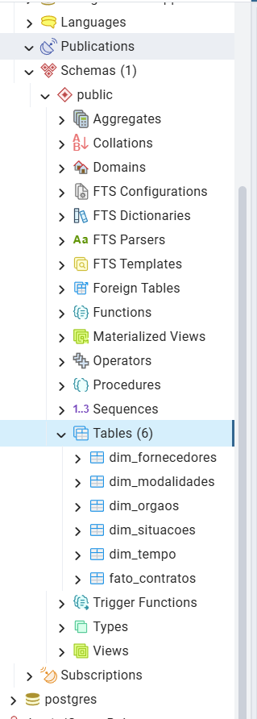
 
**pgAdmin — Query de validação: Top 10 órgãos por número de contratos**
 
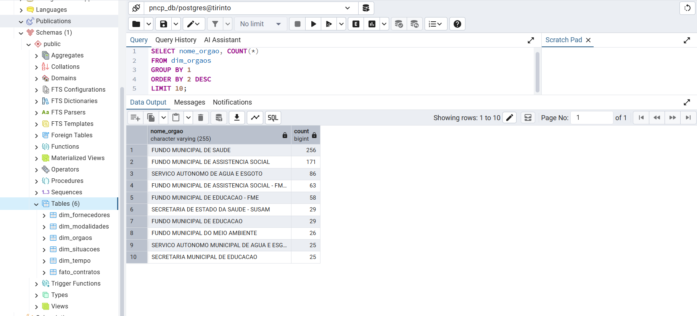
 
### Retomada após interrupção
 
| Script | Checkpoint | Comportamento |
|---|---|---|
| `bronze.py` | `_manifesto.json` por mês | Pula meses concluídos; re-verifica os 6 mais recentes |
| `silver.py` | `.parquet` em `data/silver/` | Pula meses já tratados |
| `gold_load.py` | `ano_mes_coleta` na fato | Pula meses já carregados; UPSERT nas dimensões |
 
### Reprocessar um mês específico
 
```bash
rm data/silver/contratos_2025_03.parquet
 
# No psql/pgAdmin:
DELETE FROM fato_contratos WHERE ano_mes_coleta = '202503';
 
python silver.py
python gold_load.py
```
 
---
 
## Observações Técnicas
 
**Por que PNCP e não Kaggle/UCI?**  
A base atende todos os requisitos com dados reais do governo: mais de 1 milhão de linhas, tipagem rica, API pública documentada e relevância direta para análise de gastos públicos.
 
**Limitação conhecida da API:**  
O endpoint `/contratos` (v1) não retorna o campo `situacaoContrato`. A coluna existe no schema para compatibilidade futura, mas permanece nula em 100% dos registros.
 
**Objetos aninhados na API:**  
A API PNCP retorna `orgaoEntidade`, `unidadeOrgao`, `tipoContrato` e `categoriaProcesso` como objetos JSON aninhados — não como campos planos. A função `_flatten_registro()` no `silver.py` os desaninha antes do processamento.
 
**Filtro de valores absurdos:**  
74.158 registros (1,92%) foram removidos por terem `valor_global > R$ 10 bilhões` — erros de digitação na fonte. O filtro é aplicado na Silver para que a Gold já receba dados limpos.
