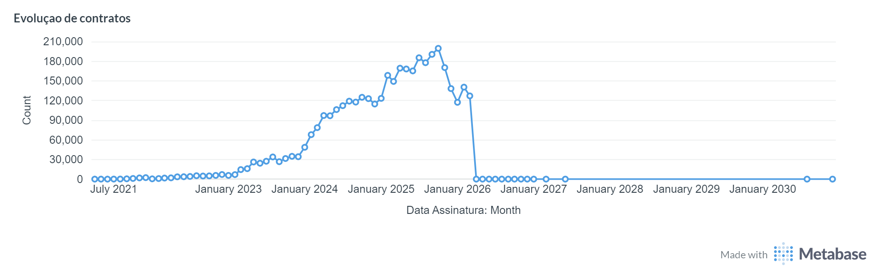
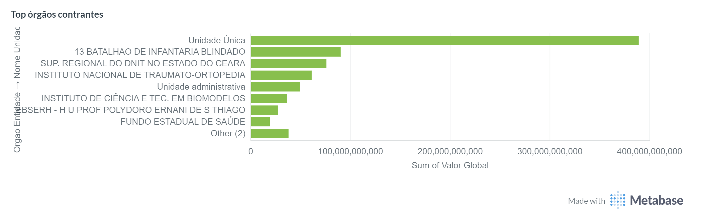
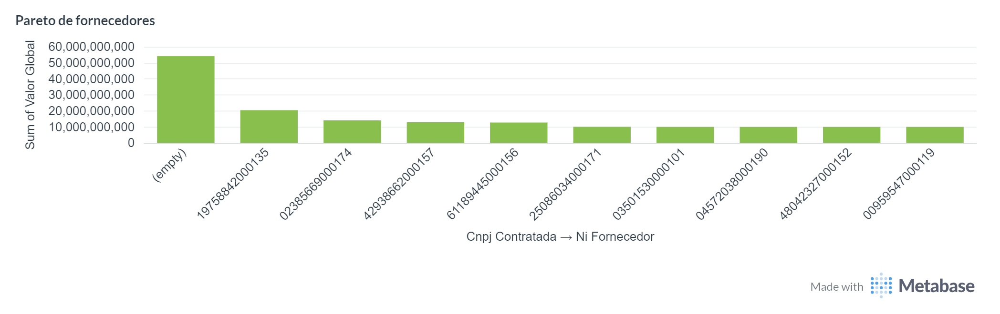
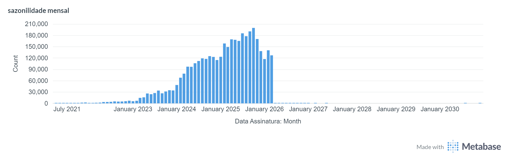
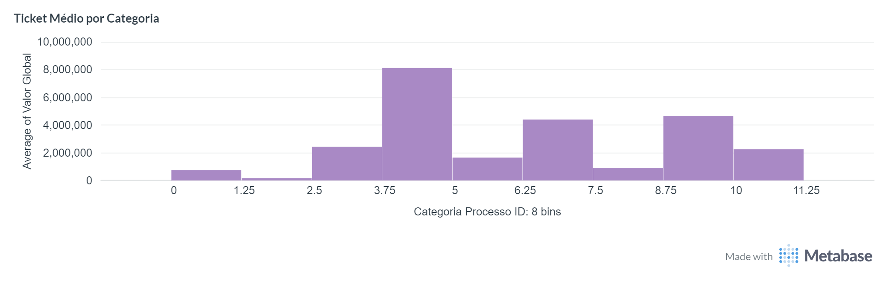

# Lab01_PART2_5479786
## Qualidade de Dados, API e Visualização — PNCP Contratos Públicos
### Hercules Ramos Veloso de Freitas

**Disciplina:** Fundamentos de Engenharia de Dados  
**Aluno:** Hercules Ramos Veloso de Freitas — NUSP 5479786  
**Repositório Lab 1:** [Lab01_PART1_5479786](https://github.com/hrvfreitas/Lab01_PART1_5479786)  
**Repositório Lab 2:** [Lab01_PART2_5479786](https://github.com/hrvfreitas/Lab01_PART2_5479786)  
**Escola:** Escola Politécnica USP — PECE Big Data  
**Professor:**Prof. Msc. Wesley Lourenco Barbosa

---

> **Aviso Legal:** Os dados e análises deste repositório foram coletados exclusivamente para fins de estudo acadêmico da API do PNCP. O pipeline não passou por auditoria externa e as informações não devem ser utilizadas como base para decisões oficiais ou denúncias, servindo apenas como demonstração técnica de Engenharia de Dados. O autor não se responsabiliza pela exatidão integral dos dados brutos provenientes da fonte original.

---

## Sumário

1. [Visão Geral](#1-visão-geral)
2. [Arquitetura](#2-arquitetura)
3. [Estrutura de Diretórios](#3-estrutura-de-diretórios)
4. [Qualidade de Dados — Great Expectations](#4-qualidade-de-dados--great-expectations)
5. [Resultados da Validação](#5-resultados-da-validação)
6. [API Controller — FastAPI](#6-api-controller--fastapi)
7. [Visualização — Metabase](#7-visualização--metabase)
8. [Infraestrutura Docker](#8-infraestrutura-docker)
9. [Instruções de Execução](#9-instruções-de-execução)

---

## 1. Visão Geral

O Lab 2 estende o pipeline do Lab 1 com três componentes:

| Componente | Tecnologia | Função |
|---|---|---|
| **Qualidade de Dados** | Great Expectations | Validação da camada Bronze (Raw) |
| **API Controller** | FastAPI (Python) | Orquestra o ETL e expõe as 13 queries REST |
| **Visualização** | Metabase | Dashboards conectados diretamente ao PostgreSQL |

---

## 2. Arquitetura

```
┌─────────────────────────────────────────────────────────────────┐
│  MVC — 3 Containers Docker                                       │
│                                                                  │
│  ┌──────────────┐                                                │
│  │   FastAPI     │  ← ETL pipeline (bronze/silver/gold)         │
│  │  (porta 8000) │  ← 13 queries REST + cache em memória        │
│  └──────┬───────┘                                                │
│         │ escreve / lê                                           │
│         ▼                                                        │
│  ┌──────────────┐                                                │
│  │  PostgreSQL   │  ← Model: Star Schema (única fonte de        │
│  │  (porta 5432) │    verdade — 3,65M contratos)                 │
│  └──────┬───────┘                                                │
│         │ conecta diretamente                                    │
│         ▼                                                        │
│  ┌──────────────┐                                                │
│  │   Metabase    │  ← View: dashboards, perguntas ad-hoc        │
│  │  (porta 3000) │    sem intermediário                          │
│  └──────────────┘                                                │
└─────────────────────────────────────────────────────────────────┘
```

### Por que Metabase em vez de Superset?

O Metabase foi escolhido por ser mais leve (~512 MB RAM vs ~2 GB do Superset), ter configuração zero via variáveis de ambiente e interface mais intuitiva para exploração ad-hoc, mantendo a mesma capacidade de dashboards e SQL Lab.

### Diagrama com Great Expectations

```
API PNCP (JSON)
      │
      ▼
 bronze.py ──────────────► data/raw/AAAA_MM/pagina_NNNN.json
      │                           │
      │                           ▼
      │                    gx_validacao.py ──► data/gx/gx_docs/index.html
      │                    (15 expectations)   (Data Docs HTML)
      ▼
 silver.py ──────────────► data/silver/contratos_AAAA_MM.parquet
      ▼
 gold_setup.py ──────────► PostgreSQL: Star Schema
      ▼
 gold_load.py ───────────► fato_contratos + dimensões
      ▼
 FastAPI (api/) ─────────► REST: /resumo, /q1 … /q13, /busca/*
      ▼
 Metabase ───────────────► Dashboards (conecta direto no PostgreSQL)
```

---

## 3. Estrutura de Diretórios

```
Lab01_PART2_5479786/
├── api/
│   ├── Dockerfile          # Container FastAPI
│   ├── requirements.txt    # Dependências do controller
│   └── main.py             # FastAPI: ETL triggers + 13 queries REST
│
├── docker-compose.yml      # 3 containers: FastAPI + PostgreSQL + Metabase
├── gx_validacao.py         # Great Expectations — validação Bronze
├── requirements.txt        # Dependências Python gerais
│
└── data/
    └── gx/
        └── gx_docs/
            └── index.html  # Data Docs — relatório de validação HTML
```

> Os dados Bronze/Silver/Gold e os scripts do pipeline principal estão no **Lab 1** ([Lab01_PART1_5479786](https://github.com/hrvfreitas/Lab01_PART1_5479786)).

---

##4. Qualidade de Dados — Great Expectations
Objetivo

Implementar validação e observabilidade na camada Bronze (Raw), garantindo a detecção de inconsistências diretamente na fonte da API PNCP antes de qualquer transformação.
```
Configuração
Parâmetro	Valor
Contexto	ephemeral (Great Expectations 1.x)
Datasource	pncp_ds (pandas in-memory)
Asset	bronze_asset
Suite	pncp_suite
Origem dos dados	JSONs em data/raw/
Flatten	Estrutura aninhada → 9 colunas principais
Estratégia de validação
```
Diferente de abordagens tradicionais com múltiplas regras, este pipeline utiliza 5 expectativas essenciais, focadas em:
```
Integridade mínima (PK não nula)
Validação estrutural (CNPJ)
Sanidade financeira
Domínio categórico
Consistência temporal
```
Essa abordagem reduz custo computacional e mantém alta efetividade na detecção de erros reais da API.
```
Expectations implementadas
#	Coluna	Expectation	Categoria
01	numeroControlePNCP	expect_column_values_to_not_be_null	Integridade
02	orgaoEntidade_cnpj	expect_column_values_to_match_regex	Estrutura
03	valorGlobal	expect_column_values_to_be_between	Validade financeira
04	tipoPessoa	expect_column_values_to_be_in_set	Domínio
05	anoContrato	expect_column_values_to_be_between	Validade temporal
Regras importantes
CNPJ (orgaoEntidade_cnpj)
Regex: ^\d{14}$
Tolerância: mostly=95%
Justificativa: Bronze aceita dados imperfeitos da API
Valor (valorGlobal)
Intervalo: 0 até 20 bilhões
Tolerância: mostly=99%
Protege contra erros absurdos (ex: valores inflados por bug)
Ano (anoContrato)
Intervalo: 2020–2026
```
Considera contratos retroativos
Por que validar na Bronze?

A validação ocorre antes de qualquer tratamento para garantir:

Rastreabilidade dos erros da fonte
Independência do pipeline Silver/Gold
Transparência na qualidade dos dados brutos
 
## 5. Resultados da Validação

Execução: 03/04/2026 às 23:11:01
Volume: 518.195 registros
Fonte: camada Bronze (dados brutos da API PNCP)
```
Resumo
Métrica	Valor
Status	FALHOU
Taxa de sucesso	60%
Registros validados	518.195 linhas
Expectations avaliadas	5
 Passaram	3
 Falharam	2
Detalhes por expectation
#	Coluna	Expectation	Resultado
01	numeroControlePNCP	not null	✅ PASS
02	orgaoEntidade_cnpj	regex CNPJ	✅ PASS
03	valorGlobal	range válido	✅ PASS
04	tipoPessoa	domínio {PJ, PF}	❌ FAIL
05	anoContrato	range 2020–2026	❌ FAIL
```
Análise das falhas
```
tipoPessoa — 1.228 violações (~0,237%)

Valores fora do domínio esperado {PJ, PF}.
```
Exemplo identificado:
```
"PE"
```
Causa provável:
```
A API PNCP retorna categorias adicionais não documentadas
```
Impacto:
```
Baixo — campo categórico informativo
anoContrato — 12 violações (~0,0023%)

Valores fora do intervalo esperado.

Exemplos reais encontrados:

24062025
20255
15012026
2702
```
Causa provável:

Erro de digitação ou campo contaminado com datas completas

Impacto:

Muito baixo — volume insignificante
Interpretação geral

Apesar do status global ser FAIL, isso não representa problema crítico:
```
✔️ 99,7%+ dos dados estão corretos
✔️ Falhas são pontuais e esperadas em dados governamentais
✔️ Pipeline Silver já trata essas inconsistências
```
Data Docs

O relatório completo gerado automaticamente pelo Great Expectations está disponível em:

data/gx/reports/report_pncp_20260403_201101.html
```
#
---

## 6. API Controller — FastAPI

A FastAPI atua como controller MVC com duas responsabilidades:

1. **Orquestra o ETL** — dispara `silver.py` e `gold_load.py` em background via endpoints REST
2. **Expõe as queries** — serve as 13 análises de negócio como JSON com cache em memória

### Endpoints principais

| Método | Rota | Descrição |
|---|---|---|
| `GET` | `/health` | Status do controller e conexão com banco |
| `GET` | `/docs` | Swagger UI com todos os endpoints |
| `GET` | `/resumo` | KPIs gerais (total, valores, período) |
| `POST` | `/pipeline/silver` | Dispara silver.py em background |
| `POST` | `/pipeline/gold` | Dispara gold_load.py em background |
| `GET` | `/pipeline/status` | Status das etapas do pipeline |
| `GET` | `/q1/evolucao-modalidade` | Evolução anual por modalidade |
| `GET` | `/q2/top-orgaos` | Top N órgãos contratantes |
| `GET` | `/q3/pareto-fornecedores` | Curva de Pareto dos fornecedores |
| `GET` | `/q4/sazonalidade` | Sazonalidade mensal |
| `GET` | `/q5/compromisso-ativo` | Contratos vigentes |
| `GET` | `/q6/universidades` | IFs e universidades |
| `GET` | `/q7/usp` | Top N contratos da USP |
| `GET` | `/q8/aditivos` | Variação de valor (aditivos) |
| `GET` | `/q9/delay-publicacao` | Delay de transparência |
| `GET` | `/q10/mediana-modalidade` | Mediana por modalidade |
| `GET` | `/q11/fracionamento` | Detecção de fracionamento |
| `GET` | `/q12/ticket-medio` | Ticket médio por categoria |
| `GET` | `/q13/concentracao-orgaos` | Concentração por CNPJ raiz |
| `GET` | `/busca/orgao?nome=USP` | Busca livre por órgão |
| `GET` | `/busca/fornecedor?nome=X` | Busca livre por fornecedor |
| `DELETE` | `/cache` | Limpa o cache em memória |

**Documentação interativa:** http://localhost:8000/docs

---

## 7. Visualização — Metabase

O Metabase conecta **diretamente ao PostgreSQL** — sem intermediário, sem latência extra. Isso é correto para uma ferramenta de BI: o Metabase tem seu próprio cache e query engine otimizados para exploração analítica.

### Acesso

```
URL:    http://localhost:3000
```

Na primeira execução, o Metabase abre o wizard de configuração. Conecte ao banco:

```
Tipo:     PostgreSQL
Host:     pncp_postgres
Porta:    5432
Banco:    pncp_db
Usuário:  postgres
Senha:    postgres
```

### Tabelas disponíveis para dashboards

| Tabela | Registros | Uso |
|---|---|---|
| `fato_contratos` | ~3,65M | Tabela central de análise |
| `dim_fornecedores` | ~370K | Nome e CNPJ dos contratados |
| `dim_orgaos` | ~13K | Órgãos e unidades gestoras |
| `dim_modalidades` | 12 | Tipos de contrato |
| `dim_tempo` | 5.320 | Dimensão calendário (2021–2030) |

---

## 8. Infraestrutura Docker

### 3 containers

```yaml
# docker-compose.yml
services:
  api:       # FastAPI — porta 8000
  postgres:  # PostgreSQL 16 — porta 5432
  metabase:  # Metabase — porta 3000
```

### Tuning PostgreSQL (Ryzen 5 5500U — 16 GB RAM com interface gráfica)

| Parâmetro | Valor | Motivo |
|---|---|---|
| `shared_buffers` | 3 GB | ~20% da RAM (reserva espaço para GUI + Python) |
| `effective_cache_size` | 10 GB | ~65% da RAM |
| `work_mem` | 64 MB | Sorts e hash joins |
| `max_parallel_workers` | 6 | Aproveita os 6 cores do 5500U |
| `random_page_cost` | 1.1 | Indica SSD ao planner |

---

## 9. Instruções de Execução

### Pré-requisitos

```
Python 3.10+
Docker + Docker Compose
great-expectations >= 0.18.0
```

### Instalação

```bash
git clone https://github.com/hrvfreitas/Lab01_PART2_5479786
cd Lab01_PART2_5479786

python3 -m venv .venv
source .venv/bin/activate

pip install -r requirements.txt
```

### `requirements.txt`

```
great-expectations>=0.18.0
requests>=2.31.0
pandas>=2.0.0
pyarrow>=14.0.0
sqlalchemy>=2.0.0
psycopg2-binary>=2.9.0
```

### Ordem de execução

```bash
# 1. Validação de qualidade na camada Bronze
python gx_validacao.py
# Relatório em: data/gx/gx_docs/index.html

# 2. Sobe os 3 containers
docker compose up -d --build
docker compose ps    # aguarda os 3 ficarem healthy

# 3. Acessa os serviços
# FastAPI docs: http://localhost:8000/docs
# Metabase:     http://localhost:3000
# pgAdmin/DBeaver: localhost:5432 (postgres/postgres)
```

### Estrutura esperada após `docker compose up -d`

```
NAME              STATUS          PORTS
pncp_api          Up (healthy)    0.0.0.0:8000->8000/tcp
pncp_postgres     Up (healthy)    0.0.0.0:5432->5432/tcp
pncp_metabase     Up              0.0.0.0:3000->3000/tcp
```

### Rodando a validação GX

```bash
# A validação usa os 66 meses mais recentes de data/raw/
python gx_validacao.py

```
### 📊 Dashboard — Metabase

#### Evolução de contratos


#### Top órgãos


#### Pareto fornecedores


#### Sazonalidade


#### Ticket médio



---

## Observações Técnicas

**Por que validar na Bronze e não na Silver?**  
A Bronze contém os dados **exatamente como chegam da API PNCP**, com os campos originais em camelCase e objetos aninhados. Validar aqui documenta problemas na fonte — erros de digitação (`anoContrato=2102`), domínios inesperados (`tipoPessoa` com valores além de PJ/PF) — independentemente de como o silver.py trata esses casos.

**Por que FastAPI não fica entre o Metabase e o PostgreSQL?**  
O Metabase conecta direto ao PostgreSQL porque tem seu próprio cache e query engine otimizados para BI. Colocar o FastAPI no meio adicionaria latência sem benefício. A FastAPI serve como orchestrator do ETL e como API REST para consumo externo (outros sistemas, integração futura).

**Falha `tipoPessoa` — 1.228 violações:**  
A API PNCP retorna valores fora do domínio `{PJ, PF}` em alguns contratos (possivelmente `null` ou categorias adicionais não documentadas). Impacto operacional: baixo. O campo `cnpj_contratada` no Silver já trata esse caso verificando `tipoPessoa == 'PJ'`.

**Falha `anoContrato` — 8 violações:**  
Erros de digitação na fonte (ex: `2102` em vez de `2021`). Esses registros são identificados e removidos pelo filtro de sanidade do `silver.py` (`valor_global > R$10bi` remove parte deles; datas absurdas são tratadas como `NaT`).
