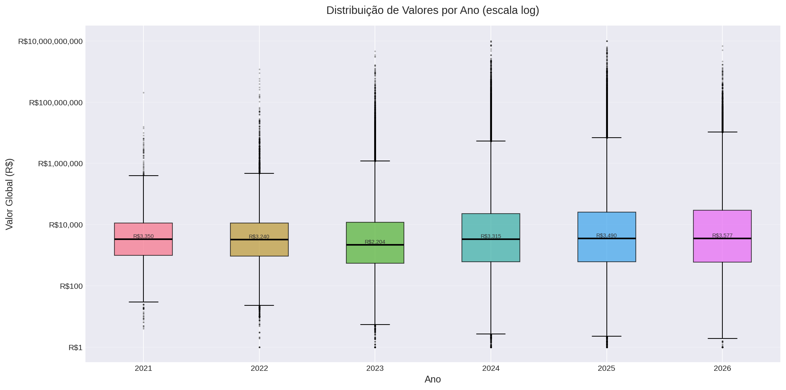
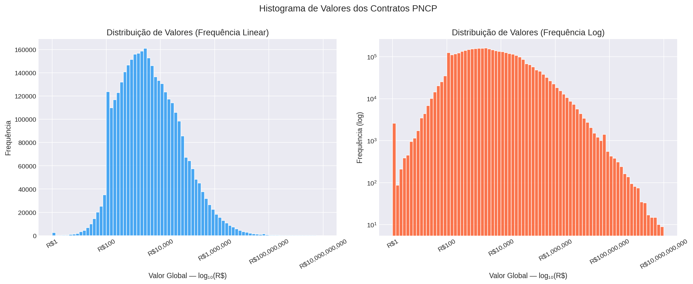
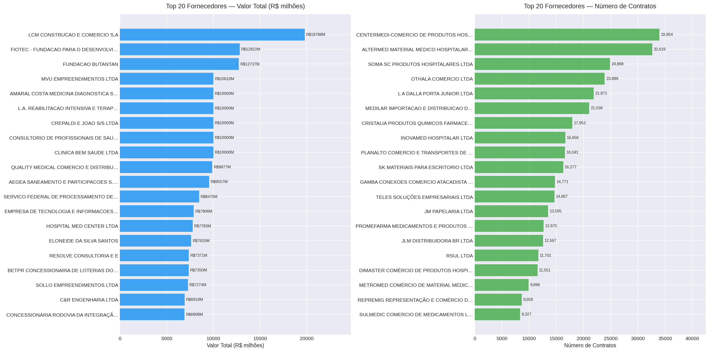
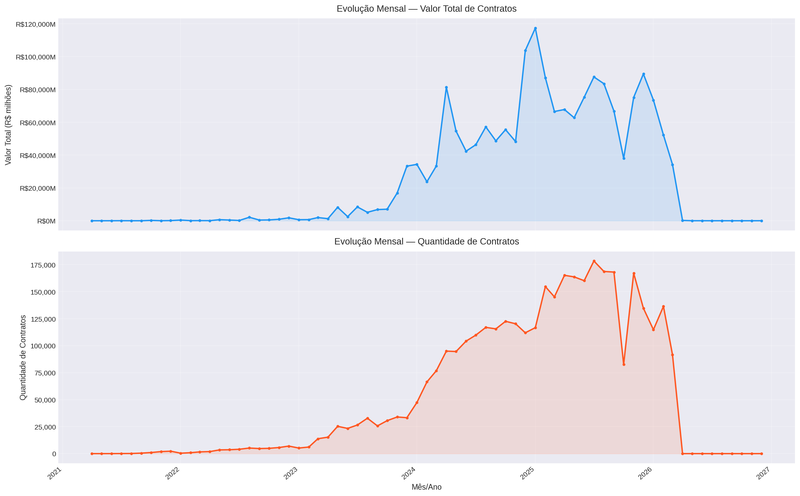
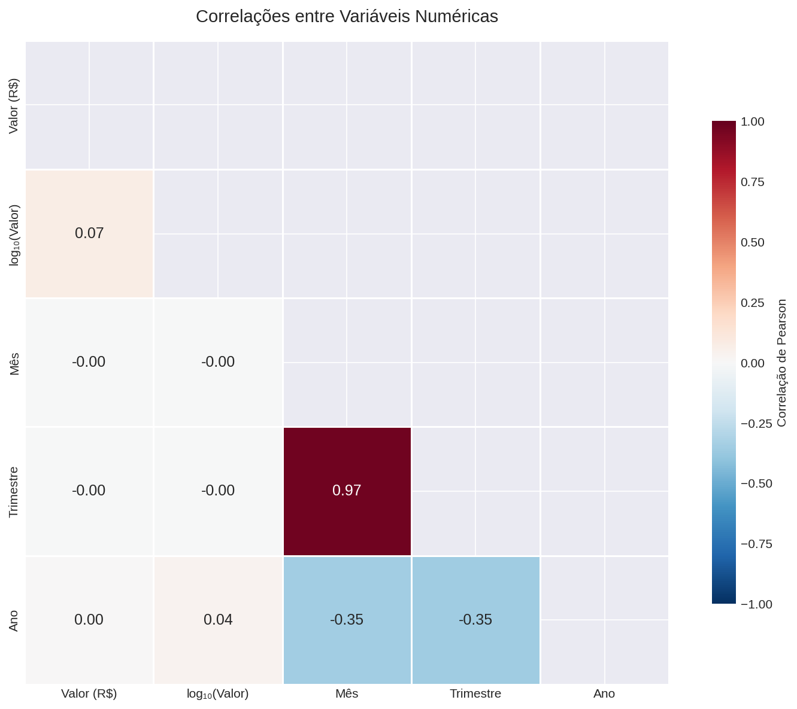

# Gráficos da Camada Silver — PNCP Contratos Públicos

**Lab01_PART1_3734509** — Gerado em 21/03/2026 21:11

**Fonte:** Portal Nacional de Contratações Públicas (PNCP)  
**Período:** 2021-04 a 2026-12  
**Total de registros:** 3,650,850  

---

## Gráfico 1 — Distribuição de Valores por Ano

Boxplot em escala log mostrando a distribuição do valor_global por ano. Cada caixa representa o IQR (P25–P75). Nota-se crescimento consistente no volume de contratos a partir de 2023.

---

## Gráfico 2 — Histograma de Distribuição de Valores

Distribuição de valor_global em escala log₁₀. A maioria dos contratos concentra-se entre R$1mil e R$1mi. A cauda longa à direita indica presença de contratos de grande porte.

---

## Gráfico 3 — Top 20 Fornecedores

Painel esquerdo: fornecedores com maior volume financeiro. Painel direito: fornecedores com maior número de contratos. Alta concentração nos 5 primeiros indica possível oligopólio em alguns segmentos.

---

## Gráfico 4 — Série Temporal Mensal

Evolução mês a mês do valor total e da quantidade de contratos publicados. Picos em dezembro (pressão de final de exercício orçamentário) e crescimento acentuado a partir de 2024 refletem a adesão crescente ao PNCP.

---

## Gráfico 5 — Heatmap de Correlações

Correlação de Pearson entre variáveis numéricas. log₁₀(Valor) e Valor mostram correlação alta (esperado). Correlação positiva entre Ano e Valor reflete crescimento temporal dos contratos.

---

